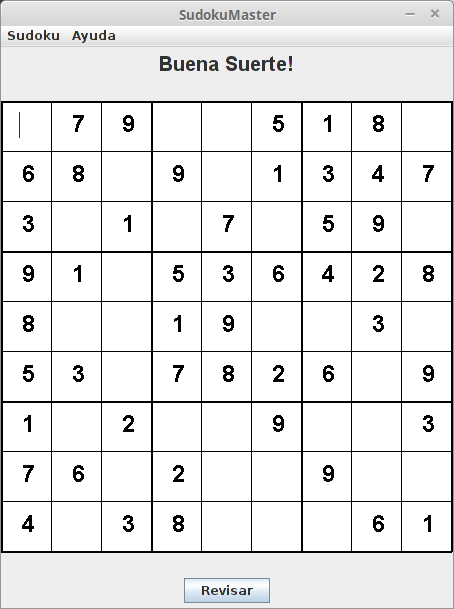

# SudokuMaster

## English

Simple Sudoku game build using Java Swing library. It has five different levels. It has a 'Check' button, that tells you if you have wrongly placed numbers.

Features to add:
* Save/Load
* Options
* Highlight cells when you have duplicate numbers in row/column/box

Based on the work of team FUXIA: [https://github.com/mihneagiurgea/fuxia](https://github.com/mihneagiurgea/fuxia)

Digging algorithm developed and described by ZHANGroup: [http://zhangroup.aporc.org/images/files/Paper_3485.pdf](http://zhangroup.aporc.org/images/files/Paper_3485.pdf)

***
## Español
Simple juego del Sudoku utilizando la librería Swing de Java. Posee cinco distintos niveles. También posee un botón 'Revisar' el cual te avisa si es tienes números mal puestos.

Características que agregrar:
* Guardar/Cargar
* Opciones
* Destacar celdas cuando existan duplicados en la misma fila/columna/caja

Basado en el trabjo de team FUXIA: [https://github.com/mihneagiurgea/fuxia](https://github.com/mihneagiurgea/fuxia)

Algoritmo de 'excavación' (Digging algorithm) desarollado y descrito por ZHANGroup: [http://zhangroup.aporc.org/images/files/Paper_3485.pdf](http://zhangroup.aporc.org/images/files/Paper_3485.pdf)
